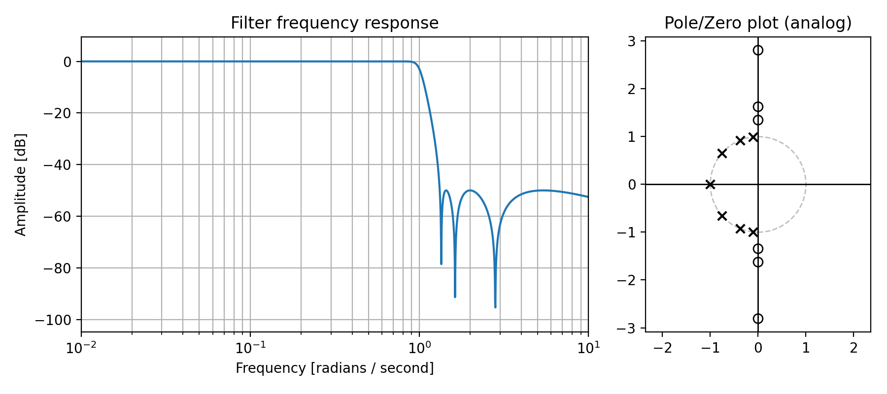

# filter-design

[](https://github.com/raphaelw/emqf-filter-design/actions/workflows/python-package.yml)

SciPy compatible design tools around Elliptic filters with minimal Q-factors (EMQF). EMQF filters are a subset of Elliptic IIR filters. They can be used for different purposes:
- Crossover filter pairs which can be used in real-time [audio filterbanks](https://doi.org/10.1109/78.469858)
    - Magnitude-complementary pairs aka [Generalized Linkwitz–Riley crossovers](https://www.native-instruments.com/fileadmin/ni_media/downloads/pdf/VAFilterDesign_2.1.0.pdf) (also [here](https://www.researchgate.net/profile/Ljiljana-Milic/publication/224633975_Magnitude_Complementary_Digital_Filter_Pairs_as_Loudspeaker_Crossovers/links/559fe43908ae5ab90245a34a/Magnitude-Complementary-Digital-Filter-Pairs-as-Loudspeaker-Crossovers.pdf))
    - Power-complementary pairs
- [Quadrature mirror filter (QMF)](https://en.wikipedia.org/wiki/Quadrature_mirror_filter) for Wavelet style filterbanks
- Efficient IIR Hilbert Transformer

## Getting started

Install package:

```sh
pip install "filterdesign @ git+https://github.com/raphaelw/filter-design.git"
```

Design and plot filter:

```python
from filterdesign import emqf
from filterdesign import filterplot

z, p, k = emqf.analog_lowpass(order=7, stopband_attenuation=50, f3db=True)

fig, (ax1, ax2) = plt.subplots(1, 2)
filterplot.plot_analog_filter_zpk((z, p, k), ax=ax[0])
filterplot.pole_zero_plot((z, p, k), unitcircle=True, ax=ax[1])
plt.show()
```



## How to contribute

Install this library in editable mode:

```sh
pip install -e .
```

Or install with all optional dependencies
```sh
pip install -e .[examples,dev,build]
```

Run tests

```sh
python -m unittest discover --start-directory tests --pattern "test_*.py" --verbose
```

Use [Black](https://github.com/psf/black) Code Formatter.
